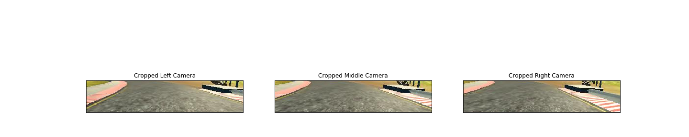
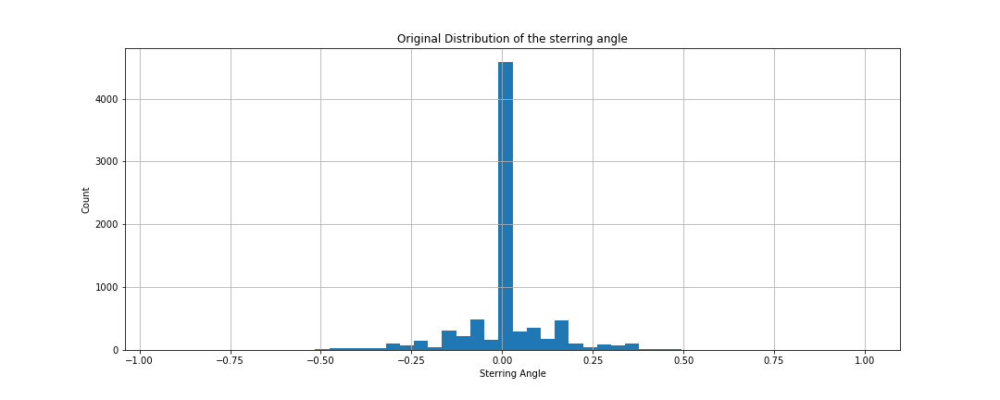

# **Behavioral Cloning** 
**Behavioral Cloning Project**

The goals / steps of this project are the following:
* Use the simulator to collect data of good driving behavior
* Build, a convolution neural network in Keras that predicts steering angles from images
* Train and validate the model with a training and validation set
* Test that the model successfully drives around track one without leaving the road
* Summarize the results with a written report


[//]: # (Image References)

[image1]: ./examples/placeholder.png "Model Visualization"
[image2]: ./examples/placeholder.png "Grayscaling"
[image3]: ./examples/placeholder_small.png "Recovery Image"
[image4]: ./examples/placeholder_small.png "Recovery Image"
[image5]: ./examples/placeholder_small.png "Recovery Image"
[image6]: ./examples/placeholder_small.png "Normal Image"
[image7]: ./examples/placeholder_small.png "Flipped Image"

## Rubric Points
### Here I will consider the [rubric points](https://review.udacity.com/#!/rubrics/432/view) individually and describe how I addressed each point in my implementation.  

---
### Files Submitted & Code Quality

#### 1. Submission includes all required files and can be used to run the simulator in autonomous mode

My project includes the following files:
* model.py containing the script to create and train the model
* drive.py for driving the car in autonomous mode
* model.h5 containing a trained convolution neural network 
* writeup_report.md summarizing the results

#### 2. Submission includes functional code
Using the Udacity provided simulator and my drive.py file, the car can be driven autonomously around the track by executing 
```sh
python drive.py model.h5
```

#### 3. Submission code is usable and readable

The model.py file contains the code for training and saving the convolution neural network. The file shows the pipeline I used for training and validating the model, and it contains comments to explain how the code works. In addition to that, I included a jupyter notebook containing the images about the procedure.

### Model Architecture and Training Strategy

#### 1. An appropriate model architecture has been employed
At the beggining, we normalized the data in the image to be between -0.5 to 0.5. After that we cropped the upper portion of the pictures that contains sky and lower portion that contains a part of the car.

In the following image, you can find the image captured from the three cameras:


After cropping the images, the model will only see the part of the road.



The normalized cropped image will be fed to Nvidia convolution neural network as desribed in the [link](https://developer.nvidia.com/blog/deep-learning-self-driving-cars/). 

The architecture consists of 9 layers, including a normalization layer, 5 convolutional layers, and 3 fully connected layers.


My model consists of a convolution neural network with 3x3 filter sizes and depths between 32 and 128 (model.py lines 18-24) 

The model includes RELU layers to introduce nonlinearity and the data is normalized in the model using a Keras lambda layer. 

#### 2. Attempts to reduce overfitting in the model
I did not include any droppout layer in the architecture as the car is driving smooth in the track. In fact, the validation loss is increasing. This is future work that will be done to make sure that the model is well overfitting.

The model was tested by running it through the simulator and ensuring that the vehicle could stay on the track.


#### 3. Model parameter tuning

The model used an adam optimizer, so the learning rate was not tuned manually.

#### 4. Appropriate training data

Training data was chosen to keep the vehicle driving on the road. I used a combination of center lane driving, recovering from the left and right sides of the road after correction factor 0.2 in the steering angle.

In addition to that, I found that the input data is not balanced and the distribution contains a lot of zero steering angle as shown.
 

So, I decided to drop 80% of the images that have zero sterring angle as shown.
 

In fact this is change that make the car successfully pass the sharp turning on the bridge.

### Model Architecture and Training Strategy

#### 1. Solution Design Approach
I used Nvidia architecture without changing anything in it.


#### 2. Creation of the Training Set & Training Process
I used the data set given to me from udacity in the [link](https://d17h27t6h515a5.cloudfront.net/topher/2016/December/584f6edd_data/data.zip). This was sufficient to complete the track.